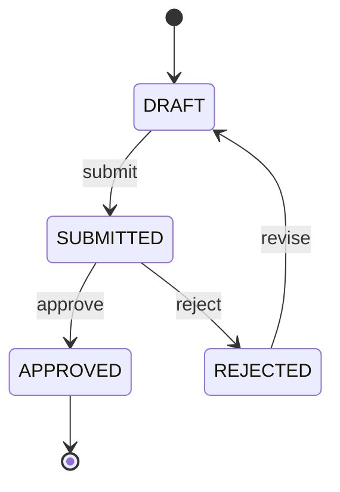
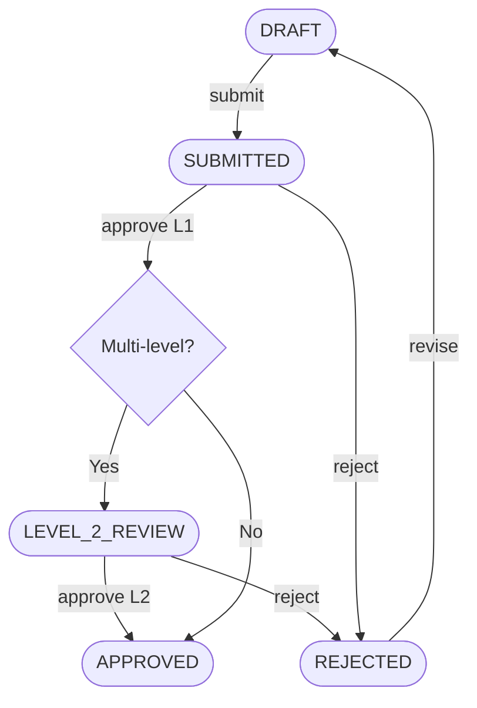

# Functional Specification Document (FSD)
# {PROJECT_NAME} — Version {VERSION}

---

## Document Control

| Field | Value |
|---|---|
| **Document Title** | {PROJECT_NAME} — Functional Specification Document |
| **Document Type** | Functional Specification Document (FSD) |
| **Project Name** | {PROJECT_NAME} |
| **Module / Domain** | {MODULE_OR_DOMAIN} |
| **Version** | {VERSION} |
| **Status** | 🔴 Draft / 🟡 In Review / 🟢 Approved *(pick one)* |
| **System** | `{ARTIFACT_ID}` (`{SERVICE_NAME}`) |
| **Organization** | PT EKSAD / {BUSINESS_UNIT} |
| **Classification** | Internal — Confidential |
| **Related BRD** | `BRD_{PROJECT_CODE}_v{VERSION}.md` |
| **Supersedes** | `FSD_{PROJECT_CODE}_v{PREV_VERSION}.md` *(if applicable)* |
| **Prepared By** | {PREPARED_BY} |
| **Reviewed By** | {REVIEWED_BY} |
| **Approved By** | {APPROVED_BY} |
| **Last Updated** | {DATE} |

> **Audience:** Business Analysts, Product Owners, QA Engineers, Frontend Developers.
> This document describes **WHAT** the system does — user flows, business rules, API behaviour, and use cases.
> For **HOW** it is built (schemas, tech stack, event contracts), see `TSD_{PROJECT_CODE}_v{VERSION}.md`.

> **Related Documents:**
> - `BRD_{PROJECT_CODE}_v{VERSION}.md` — Business requirements
> - `TSD_{PROJECT_CODE}_v{VERSION}.md` — Technical specification

---

## Revision History

| Version | Date | Author | Summary of Changes |
|---|---|---|---|
| 1.0 | {DATE} | {AUTHOR} | Initial draft |
| {VERSION} | {DATE} | {AUTHOR} | {CHANGES} |

---

## Approval

| Role | Name | Signature | Date |
|---|---|---|---|
| Business Owner | | | |
| Project Manager | | | |
| Lead BA | | | |
| Lead Developer / SA | | | |

---

## Table of Contents

1. [Introduction](#1-introduction)
2. [System Overview](#2-system-overview)
3. [Actors & Role Access Control](#3-actors--role-access-control)
4. [Traceability Matrix](#4-traceability-matrix)
5. [Feature Specifications](#5-feature-specifications)
6. [Approval Workflow Engine](#6-approval-workflow-engine)
7. [Audit Trail](#7-audit-trail)
8. [Notification & Scheduling](#8-notification--scheduling)
9. [Global Rules](#9-global-rules)
10. [Business Rules — Master Reference](#10-business-rules--master-reference)
11. [API Endpoint Catalog](#11-api-endpoint-catalog)
12. [Non-Functional Requirements](#12-non-functional-requirements)
13. [Error Code Catalog](#13-error-code-catalog)
14. [Gap Analysis](#14-gap-analysis)
15. [Open Issues & Decisions Log](#15-open-issues--decisions-log)
16. [Glossary](#16-glossary)
17. [Reserved Field Summary](#17-reserved-field-summary)
18. [Appendix — Change Log](#appendix--change-log)

---

## 1. Introduction

### 1.1 Purpose

> *Describe the purpose of this document. Explain that the FSD translates the business requirements and features defined in the BRD into detailed, testable system behaviour. State which BRD version this document is derived from and which module(s) it covers.*

### 1.2 Scope

> *Define the functional boundary of this document — which features and modules are covered, and which are explicitly excluded. Reference the BRD scope where relevant.*

### 1.3 Intended Audience

> *Identify who this document is written for and how each audience should use it.*

| Audience | Purpose |
|---|---|
| Business Analyst | Authoring and maintaining functional requirements |
| Developer / System Analyst | Implementing system behaviour described here |
| QA / Tester | Deriving test cases from functional requirements and acceptance criteria |
| Business Owner / Stakeholder | Reviewing and approving functional behaviour |

---

## 2. System Overview

### 2.1 What This System Does

> *2–3 sentences: what the system is, what business process it automates, and who uses it.*

**{PROJECT_NAME}** is a **{SHORT_DESCRIPTION}** that enables **{PRIMARY_USER_GROUP}** to **{PRIMARY_ACTION}**.

### 2.2 What Has Changed

| Area | Before (v{PREV_VERSION} / Manual) | After (v{VERSION}) |
|------|---------------------------------|-------------------|
| Architecture | {OLD_ARCHITECTURE} | Dedicated microservice on the EKSAD platform |
| Authentication | {OLD_AUTH} | Token-based authentication — stateless, role-aware |
| Audit Trail | {OLD_AUDIT} | Automatic — every data action is logged with full actor and before/after context |
| Multi-Tenant | {OLD_TENANT} | Full data isolation per organisation — users only access their own data |
| {CUSTOM_AREA} | {OLD_WAY} | {NEW_WAY} |

### 2.3 Key Modules

> *Summarise the key capabilities delivered by this FSD. Each capability listed here must correspond to a Feature defined in Section 5.*

| Feature ID | Module | Description | Audit Category |
|---|--------|-------------|----------------|
| F-001 | {MODULE_1} | {DESCRIPTION_1} | `{Project} — {MODULE1}` |
| F-002 | {MODULE_2} | {DESCRIPTION_2} | `{Project} — {MODULE2}` |
| F-003 | Auth | Authentication and role-based access control | `{Project} — Auth` |
| F-004 | Audit | Automatic CRUD audit logging | `{Project} — Audit` |

### 2.4 System Context Diagram

> *Illustrate how this service interacts with the EKSAD platform and external actors. Use functional actor names — no ports, technology names, or infrastructure details.*

```mermaid
graph TD
    User([User / Client]) -->|Authenticated request| GW[API Gateway]
    GW -->|Routes to| SVC[{SERVICE_NAME}]
    SVC -->|Reads / Writes| DB[(Data Store)]
    SVC -->|Publishes audit event| AUDIT[Audit Service]
    SVC -->|Publishes file event| STORAGE[File Storage Service]
    GW --> AUTH[Authentication Service]
```

---

## 3. Actors & Role Access Control

### 3.1 Actor Definitions

> *Define every human and system actor that interacts with this module. Every actor listed here must appear in at least one process flow. Distinguish between human actors (roles performing actions) and system actors (automated processes or external systems).*

| Actor ID | Actor Name | Type | Description |
|---|---|---|---|
| ACT-001 | {ROLE_NAME} | Human | {DESCRIPTION} |
| ACT-002 | API Gateway | System | Entry point — enforces authentication and routes requests to the appropriate service |
| ACT-003 | Audit Service | System | Receives and stores a complete audit record for every data-modifying action |
| ACT-004 | File Storage Service | System | *(Conditional)* Manages file uploads, access control, and URL generation |

### 3.2 Role Definitions

| Role | Code | Description | Tenant Scope |
|------|------|-------------|-------------|
| Super Admin | `ROLE_SUPER_ADMIN` | Full access across all tenants | Cross-tenant |
| Admin | `ROLE_ADMIN` | Full access within own tenant | Single tenant |
| {ROLE_1} | `ROLE_{ROLE1_CODE}` | {ROLE1_DESCRIPTION} | {SCOPE} |
| {ROLE_2} | `ROLE_{ROLE2_CODE}` | {ROLE2_DESCRIPTION} | {SCOPE} |
| Viewer | `ROLE_VIEWER` | Read-only access | Single tenant |

### 3.3 Role Access Control Matrix

> *C = Create · R = Read · U = Update · D = Delete · A = Approve · X = No Access*
> *Every Feature in Section 5 must appear as a column. Sensitive and irreversible actions (approve, delete) must be restricted to explicitly named roles.*

| Actor | F-001 [{FEATURE_1}] | F-002 [{FEATURE_2}] | F-003 [Auth] | F-004 [Audit] |
|---|---|---|---|---|
| Super Admin | C, R, U, D, A | C, R, U, D, A | R | R |
| Admin | C, R, U, D | C, R, U, D | R | R |
| {ROLE_1} | C, R, U | R | R | X |
| {ROLE_2} | R | R | R | X |
| Viewer | R | R | R | X |

---

## 4. Traceability Matrix

> *This section maps the full requirement chain from User Requirements through to Functional Requirements. Every FR must trace back to a Feature, every Feature to a BR, and every BR to a UR. No orphan elements are permitted at any level. This matrix must be kept current with every document revision.*

> **Rule:** Any FR that cannot be traced to a BR must be escalated. It must be added to the BRD first and confirmed before being included in this FSD.

| UR ID | BR ID | Feature ID | FR ID | FR Title |
|---|---|---|---|---|
| UR-{DOMAIN}-001 | BR-001 | F-001 | FR-{MODULE}-001 | {FR_TITLE} |
| UR-{DOMAIN}-002 | BR-002 | F-002 | FR-{MODULE}-002 | {FR_TITLE} |

---

## 5. Feature Specifications

> *This section contains the full functional specification for each feature in scope. Every feature must include all required components. Omitting any component is a documentation defect that blocks FSD approval.*

> **Required components per feature:** Precondition · Postcondition · Functional Requirements · Acceptance Criteria · Main Flow · Alternative Flow(s) · Exception Flow(s) · Flow Diagram · Validation Rules · State Machine (if applicable) · UI Mapping · Error Handling · Data Requirements · Reserved Field Requirements (for transactional entities) · Integration (or explicit "None")

---

### 5.0.1 Service Naming Decision

> *BA produces candidate service names during BRD→FSD transition. SA finalizes ports + database names in TSD §18 Service Registry.
> Convention: `svc-{function}` — lowercase, hyphen, domain-agnostic.
> FIXED services that MUST NOT be renamed: `eksad-core-auth`, `eksad-core-audittrail`, `eksad-core-storage`, `svc-user-management`, `svc-tenant-management`, `svc-master-data`.*

| Business Module (BA Label) | SA Technical Name | Port | Database | Status |
|---------------------------|-------------------|------|----------|--------|
| {Business Module Name 1}  | `svc-{function}`  | `:808x` | `eksad_{function}` | Confirmed / Pending |
| {Business Module Name 2}  | `svc-{function}`  | `:808x` | `eksad_{function}` | Confirmed / Pending |
| Master Brand & Catalog    | `svc-master-data` (FIXED) | `:8086` | `eksad_master` | Standard |

---

### 5.1 Feature F-001 — {FEATURE_1_NAME}

> *Provide a narrative description of this feature: what business capability it delivers, who uses it, and why it exists. Reference the source BR and the business objective it fulfils.*

**Source BR:** BR-001
**Source UR:** UR-{DOMAIN}-001
**Priority:** P1 / P2 / P3
**Module Type Prefix:** `{PROJECT_CODE}.{MODULE1_CODE}`

---

#### 5.1.1 Precondition & Postcondition

| | Description |
|---|---|
| **Precondition** | *State that must be true before this feature's flow can begin (e.g. user is authenticated, record exists in status X)* |
| **Postcondition** | *State that is true after the main flow completes successfully (e.g. record status changed to Y, audit event published)* |

---

#### 5.1.2 Functional Requirements

> *Each FR must describe exactly one system behaviour. It must be testable and unambiguous. Use "must" for mandatory behaviour. One requirement per ID — never bundle two behaviours under one FR.*

| FR ID | Functional Requirement | Source Feature | Priority |
|---|---|---|---|
| FR-{MODULE1}-001 | The system must {specific, testable behaviour}. | F-001 | P1 |
| FR-{MODULE1}-002 | The system must {specific, testable behaviour}. | F-001 | P1 |
| FR-{MODULE1}-003 | The system must {specific, testable behaviour}. | F-001 | P2 |

##### Acceptance Criteria

> *Every FR must have at least one acceptance criterion in Given / When / Then format. These are the conditions QA will use to verify the requirement.*

**FR-{MODULE1}-001**
```
Given {specific precondition},
When  {specific action is performed},
Then  {specific, measurable outcome occurs}.
```

**FR-{MODULE1}-002**
```
Given {specific precondition},
When  {specific action is performed},
Then  {specific, measurable outcome occurs}.
```

---

#### 5.1.3 Process Flow

> *Every step must capture all four dimensions: actor action, system response, data validation performed, and state change (if any).*

##### Main Flow

| Step | Actor | Action | System Response | Validation | State Change |
|---|---|---|---|---|---|
| 1 | {ACTOR} | {ACTION} | {RESPONSE} | {VALIDATION} | {STATE_CHANGE} |
| 2 | {ACTOR} | {ACTION} | {RESPONSE} | {VALIDATION} | {STATE_CHANGE} |

##### Alternative Flow(s)

> *Document every valid deviation from the main path. Minimum one alternative flow per feature.*

**ALT-001 — {Name of Alternative Scenario}**

| Step | Condition | Actor | Action | System Response |
|---|---|---|---|---|
| 1 | {CONDITION} | {ACTOR} | {ACTION} | {RESPONSE} |

##### Exception Flow(s)

> *Document every error or failure path. Minimum one exception flow per feature.*

**EXC-001 — {Name of Exception Scenario}**

| Step | Condition | Actor | Action | System Response | User Message |
|---|---|---|---|---|---|
| 1 | {CONDITION} | {ACTOR} | {ACTION} | {RESPONSE} | {MESSAGE} |

---

#### 5.1.4 Process Flow Diagram

> **Mermaid diagram is MANDATORY for every process flow — Main, Alternative, and Exception.**
> Use `flowchart TD` or `flowchart LR` inside a fenced ` ```mermaid ` block.
> **ASCII art, box-drawing characters, and plain-text flow diagrams are strictly forbidden.**
> A feature with any flow missing a Mermaid diagram is an incomplete document.

**Main Flow Diagram**

```mermaid
flowchart TD
    A([Start: Precondition met]) --> B[{ACTOR} performs {ACTION}]
    B --> C{System validates input}
    C -- Valid --> D[System processes data]
    D --> E[System persists record]
    E --> F[Audit record created automatically]
    F --> G([End: Postcondition met])
    C -- Invalid --> H[System returns validation error]
    H --> B
    D -- Business rule violation --> I[System returns error]
    I --> B
```

**Alternative Flow Diagram(s)** — repeat this block for each alternative flow

```mermaid
flowchart TD
    A([ALT-{N}: {Condition met}]) --> B[{ACTOR} {ACTION}]
    B --> C[System {RESPONSE}]
    C --> D([End: {Outcome}])
```

**Exception Flow Diagram(s)** — repeat this block for each exception flow

```mermaid
flowchart TD
    A([EXC-{N}: {Error condition}]) --> B[System detects {PROBLEM}]
    B --> C[System returns error response]
    C --> D[User receives message: {MESSAGE}]
    D --> E([End: Flow terminated])
```

---

#### 5.1.5 Validation Rules

> *Define all field-level and business-rule validations that apply to this feature. Every validation must be specific and testable. Link each rule to the FR it enforces.*

| Rule ID | Field / Condition | Validation Rule | Error Message | Source FR |
|---|---|---|---|---|
| VAL-{MODULE1}-001 | `{FIELD_1}` | Required; max {N} chars; not blank | `{MODULE1}_FIELD1_REQUIRED` | FR-{MODULE1}-001 |
| VAL-{MODULE1}-002 | `{FIELD_2}` | Must be a valid date value | `{MODULE1}_FIELD2_INVALID` | FR-{MODULE1}-001 |
| VAL-{MODULE1}-003 | `{FIELD_3}` | Must be a non-negative amount | `{MODULE1}_FIELD3_INVALID` | FR-{MODULE1}-002 |
| VAL-{MODULE1}-004 | Organisation scope | Auto-injected from authenticated user identity — must not be blank | — | FR-AUTH-001 |
| VAL-{MODULE1}-005 | `{field}_file_id` | *(if applicable)* Must reference a valid uploaded file in the File Storage Service | `{MODULE1}_FILE_INVALID` | FR-{MODULE1}-001 |

---

#### 5.1.6 State Machine

> *Complete this section for any feature where an entity changes status. If the feature has no status-based entity, write "Not applicable" and state why.*

##### State Table

| State ID | State Name | Description |
|---|---|---|
| ST-001 | `DRAFT` | Record created but not submitted |
| ST-002 | `SUBMITTED` | Awaiting review |
| ST-003 | `APPROVED` | Final approved state (terminal) |
| ST-004 | `REJECTED` | Rejected — can be revised |

##### Transition Table

| From State | To State | Trigger | Actor | Condition | Business Rule |
|---|---|---|---|---|---|
| ST-001 | ST-002 | `submit` | {ROLE} | All required fields valid | BR-{N} |
| ST-002 | ST-003 | `approve` | {APPROVER_ROLE} | Level approver confirms | BR-{N} |
| ST-002 | ST-004 | `reject` | {APPROVER_ROLE} | Reason provided | BR-{N} |
| ST-004 | ST-001 | `revise` | {ROLE} | Revision notes provided | BR-{N} |

##### State Diagram



---

#### 5.1.7 UI Mapping

> *Map every UI element to the Functional Requirement it supports. Every FR that involves a user interface must have at least one UI element mapped to it.*

| UI ID | UI Element | Description | Behaviour / Constraint | Source FR |
|---|---|---|---|---|
| UI-{MODULE1}-001 | {Input field / Button / Dropdown} | {DESCRIPTION} | {e.g. Required; enabled only when all fields valid} | FR-{MODULE1}-001 |
| UI-{MODULE1}-002 | {INPUT} | {DESCRIPTION} | {BEHAVIOUR} | FR-{MODULE1}-002 |

##### Mockup / Wireframe

> *Attach or embed the screen mockup for this feature. If mockup is not yet available, write "Pending — [owner name] — [expected date]" and log it in the Issues Log (§15).*

| Mockup ID | Screen Name | Mockup Source | Status | Notes |
|---|---|---|---|---|
| MK-{MODULE1}-001 | {SCREEN_NAME} | Figma / Image / Sketch | Pending / Final | |

---

#### 5.1.8 Error Handling

> *Define every error scenario for this feature. Generic error descriptions are not acceptable — each entry must specify the exact condition, what the system does, and what the user sees.*

| Error ID | Error Type | Condition | System Response | User Message |
|---|---|---|---|---|
| ERR-{MODULE1}-001 | Validation | Required field missing or invalid | Return HTTP 400 with error code | `{FIELD} is required / invalid` |
| ERR-{MODULE1}-002 | Authorisation | Insufficient role for this action | Return HTTP 403 | `You do not have permission to perform this action` |
| ERR-{MODULE1}-003 | Not Found | Record with given ID does not exist | Return HTTP 404 | `{ENTITY} not found` |
| ERR-{MODULE1}-004 | Invalid State | Action not allowed in current entity state | Return HTTP 422 | `Cannot perform this action in current state` |
| ERR-{MODULE1}-005 | System | Unexpected server error | Return HTTP 500; log stack trace | `An unexpected error occurred` |

**Error Types:** Validation · Authorisation · Not Found · Invalid State · System · Timeout · Concurrency

---

#### 5.1.9 Data Requirements

> *Define all data entities and fields required by this feature. Every field must support at least one FR. Fields with no FR linkage must be removed.*

**Entity: {ENTITY_1_NAME}**

| Field Name | Data Type | Required | Validation Rule | Source FR |
|---|---|---|---|---|
| `id` | identifier (system-generated) | Yes | Unique; auto-assigned by the system | FR-{MODULE1}-001 |
| `{field_name}` | text / number / date / amount / boolean / list | Yes / No | {VALIDATION} | FR-{MODULE1}-001 |
| `{field}_file_id` | file reference | No | Must reference a valid uploaded file in the File Storage Service | FR-{MODULE1}-002 |
| `status` | text (enumerated) | Yes | One of: `DRAFT`, `SUBMITTED`, `APPROVED`, `REJECTED` | FR-{MODULE1}-001 |
| `created_at` | datetime (system-generated) | Yes | Set automatically at creation | — |
| `created_by` | text | Yes | Identity of the user who created the record | — |
| `updated_at` | datetime (system-generated) | Yes | Updated automatically on any change | — |
| `updated_by` | text | Yes | Identity of the user who last modified the record | — |
| `deleted_at` | datetime | No | Null = active record; set when the record is archived (soft delete) | BR-003 |
| `deleted_by` | text | No | Identity of the user who archived the record | BR-003 |

> Organisation scope is enforced automatically by the platform on all records — it does not appear as a user-visible input field.

> Reserved field slots are available for tenant-specific custom fields (opt-in). Slot assignments are documented in §5.1.12. No SQL types listed here — types are determined by slot configuration.

---

#### 5.1.10 Audit Log Actions

| Action | Module Type String | Trigger |
|--------|--------------------|---------|
| Create | `{PROJECT_CODE}.{MODULE1_CODE}.CREATE` | `POST /...` |
| Update | `{PROJECT_CODE}.{MODULE1_CODE}.UPDATE` | `PUT /...` |
| Delete | `{PROJECT_CODE}.{MODULE1_CODE}.DELETE` | `DELETE /...` |
| Submit | `{PROJECT_CODE}.{MODULE1_CODE}.SUBMIT` | `PATCH /.../submit` |
| Approve | `{PROJECT_CODE}.{MODULE1_CODE}.APPROVE` | `PATCH /.../approve` |
| Reject | `{PROJECT_CODE}.{MODULE1_CODE}.REJECT` | `PATCH /.../reject` |

---

#### 5.1.11 Integration

> *Define all integration points for this feature. If there is no integration, write explicitly: "None — this feature does not integrate with any internal or external system." Do not leave this section blank.*

| Integration ID | System / Module | Direction | Trigger | Data Exchanged | Source FR |
|---|---|---|---|---|---|
| INT-{MODULE1}-001 | Audit Service | Outbound | Every data-modifying operation | Audit record (actor, timestamp, before/after state, module) | FR-AUDIT-001 |
| INT-{MODULE1}-002 | File Storage Service | Outbound | *(Conditional)* File upload | File reference ID returned to caller | FR-{MODULE1}-001 |

---

#### 5.1.12 Reserved Field Requirements

> *Document any tenant-specific custom fields required for this feature's transactional entities.
> If no custom fields are needed, state explicitly: "No reserved fields required for this entity."
> See `EKSAD_RESERVED_FIELD_PATTERNS.md` for full specification.*

| Tenant | Entity | Field Key (Slot) | Display Label | Type | Required | Validation | Conditional `when` | Form Section |
|--------|--------|------------------|---------------|------|----------|-----------|--------------------|--------------|
| {TENANT} | {ENTITY} | `reserved_str_1` | {LABEL} | text | yes / no | `{REGEX or RANGE}` | `{when clause or —}` | {SECTION} |
| {TENANT} | {ENTITY} | `reserved_num_1` | {LABEL} | numeric | no | `min=0, max=30` | — | {SECTION} |
| {TENANT} | {ENTITY} | `reserved_bool_1` | {LABEL} | boolean | no | — | — | {SECTION} |

If no custom fields:

> **No reserved fields required for this entity.** Entity uses standard fields only — no configurable custom field slots are needed.

---

### 5.2 Feature F-002 — {FEATURE_2_NAME}

> *Repeat the full structure from §5.1 for each additional feature. Every feature must have all components completed. Do not compress or combine features.*

---

## 6. Approval Workflow Engine

> *Use this section for any module that has multi-step human approval. Skip if the system has no approval flows.*

### 6.1 Overview

The approval engine is a **generic, configurable state machine** shared across modules. It supports:
- Single-level approval
- Multi-level approval (sequential or parallel — specify which)
- Approval delegation
- Rejection with required reason

### 6.2 Generic Approval States

> *See §6.5 for the Mermaid flow diagram. ASCII and plain-text state representations are not permitted.*

| State | Description |
|-------|-------------|
| `DRAFT` | Record created but not yet submitted for review |
| `SUBMITTED` | Submitted — awaiting approval at the current level |
| `APPROVED` | Final approved state (terminal) |
| `REJECTED` | Rejected — can be revised and resubmitted |

### 6.3 Approval Configuration per Module

| Module | Approval Levels | Level 1 Approver Role | Level 2 Approver Role | Auto-Approve Condition |
|--------|-----------------|-----------------------|-----------------------|----------------------|
| {MODULE_1} | {N} | `ROLE_{APPROVER_1}` | `ROLE_{APPROVER_2}` | {CONDITION or "None"} |
| {MODULE_2} | {N} | `ROLE_{APPROVER_1}` | — | {CONDITION or "None"} |

### 6.4 Approval Actions

| Action | Description | Allowed Roles | Required Fields |
|--------|-------------|---------------|-----------------|
| `submit` | Move from DRAFT → SUBMITTED | Record owner | — |
| `approve` | Advance to next level or APPROVED | Level approver role | `comment` (optional) |
| `reject` | Move to REJECTED | Level approver role | `reason` (required) |
| `revise` | Move from REJECTED → DRAFT | Record owner | `revision_notes` |
| `delegate` | Assign approval to another user | Approver | `delegatee_user_id` |

### 6.5 Approval Flow Diagram



### 6.6 Notification Triggers

| Event | Recipient | Channel | Template |
|-------|-----------|---------|----------|
| SUBMITTED | Level 1 Approver | Email + In-App | `{TEMPLATE_SUBMITTED}` |
| APPROVED | Record Owner | Email + In-App | `{TEMPLATE_APPROVED}` |
| REJECTED | Record Owner | Email + In-App | `{TEMPLATE_REJECTED}` |
| {CUSTOM_EVENT} | {RECIPIENT} | {CHANNEL} | `{TEMPLATE}` |

---

## 7. Audit Trail

### 7.1 What Gets Logged

> *Every data-modifying operation is automatically captured by the platform. No manual wiring is required.*

| Field | Source | Example |
|-------|--------|---------|
| `transaction_id` | Record ID after persist | `"txn-00123"` |
| `action` | Operation type | `"CREATE"`, `"UPDATE"`, `"DELETE"` |
| `username` | Authenticated user identity | `"john.doe@eksad.com"` |
| `role` | User's assigned role | `"ROLE_ADMIN"` |
| `status` | Operation outcome | `"SUCCESS"` or `"FAIL"` |
| `fail_reason` | Failure description (if any) | `"Record not found"` |
| `request_uri` | Full request path | `"/api/v1/transactions/create"` |
| `request_services` | Serialized request payload | JSON string |
| `request_time` | Timestamp when the request was received | `2026-06-03T08:00:00Z` |
| `response_time` | Timestamp when the response was sent | `2026-06-03T08:00:00.150Z` |
| `data_before` | Record state before the change | JSON string |
| `data_after` | Record state after the change | JSON string |
| `log_activity_type` | Module and action identifier | `"{Project} — {MODULE} — CREATE"` |
| `tenant_id` | Organisation identifier from authentication | `"eksad-group"` |

### 7.2 Viewing Audit Logs

| Endpoint | Description |
|----------|-------------|
| `GET /api/v1/audit?moduleType={type}&page={n}` | List logs by module type |
| `GET /api/v1/audit?actor={username}&page={n}` | List logs by actor |
| `GET /api/v1/audit?from={epoch}&to={epoch}` | List logs by date range |

---

## 8. Notification & Scheduling

> *Skip if the system has no scheduled jobs or notifications.*

### 8.1 Notification Channels

| Channel | Description | Config |
|---------|-------------|--------|
| In-App | Event-driven notification delivered to the user's in-app notification centre | Template-based per tenant |
| Email | Email delivered via the platform notification service | Template-based per tenant |

### 8.2 Scheduled Jobs

| Job Name | Trigger | Description | Audit Category |
|----------|---------|-------------|----------------|
| {JOB_1} | Cron: `{CRON_EXPRESSION}` | {DESCRIPTION} | `{Project} — Scheduler — {JOB1}` |
| {JOB_2} | Cron: `{CRON_EXPRESSION}` | {DESCRIPTION} | `{Project} — Scheduler — {JOB2}` |

> ⚠️ **Note:** Scheduled jobs must be stateless — they must not rely on in-process state between executions. Use injected services only.

---

## 9. Global Rules

> *Rules that apply across all features in this FSD — not specific to any one feature.*

| Rule ID | Global Rule | Applies To |
|---|---|---|
| GRULE-001 | Every Feature must map to a Business Requirement. No feature outside the BRD scope is permitted. | All features |
| GRULE-002 | All requirement IDs (FR-XXX, UI-XXX, VAL-XXX, ERR-XXX) must remain consistent and unique across this document. | All sections |
| GRULE-003 | Any new requirement identified during FSD authoring that has no BRD source must be escalated to the BRD first and confirmed before inclusion here. | All features |
| GRULE-004 | All API endpoints must require `Authorization: Bearer {JWT}` unless explicitly marked PUBLIC. | All APIs |
| GRULE-005 | All data-modifying operations must produce an audit log entry — no data change may be made without an associated audit record. | All features |
| GRULE-006 | No domain service may access file storage infrastructure directly — all file operations go through the File Storage Service. | All file-handling features |
| GRULE-007 | Every transactional entity must run Reserved Field Discovery during FSD authoring. Result is either a filled Reserved Field Requirements table (§5.1.12) or an explicit "No reserved fields required" statement. | All transactional features |
| GRULE-008 | Domain service names must be confirmed via the BA→SA naming workflow. FSD §5.0.1 Service Naming Decision must be filled. `svc-user-management`, `svc-master-data`, `svc-tenant-management`, and `eksad-core-*` are FIXED names and MUST NOT be renamed. | All domain services |
| GRULE-009 | Master/catalog data references are stored as `{entity}_id` lookups against `svc-master-data` — never duplicated as denormalised columns owned by the domain service. | All features that consume master data |

---

## 10. Business Rules — Master Reference

> *Consolidate all BR-{N} from all features here for quick reference.*

| ID | Rule | Module | Priority | Source FR |
|----|------|--------|----------|-----------|
| BR-001 | Records must never be hard-deleted (soft delete only) | All | P1 | FR-ALL |
| BR-002 | Every data operation must produce an audit log with the performing user's identity and organisation | All | P1 | FR-AUDIT-001 |
| BR-003 | Users cannot access data outside their own organisation | All | P1 | FR-AUTH-003 |
| BR-004 | Financial amounts must be recorded with full decimal precision — rounding or approximation is not permitted | {MODULE} | P1 | {FR_ID} |
| BR-PLATFORM-006 | Files must be uploaded through the File Storage Service only. Domain services store a file reference ID — never raw storage keys or delivery URLs. | All | P1 | FR-ALL |
| BR-PLATFORM-007 | Publicly accessible files are served via a permanent link. Restricted files are served via a time-limited access link generated at request time. | All | P1 | FR-ALL |
| BR-PLATFORM-008 | Thumbnail visibility inherits from its parent file. A restricted file always has a restricted thumbnail. | All | P1 | FR-ALL |
| BR-PLATFORM-009 | File size and format are enforced at upload by the File Storage Service. Domain services must not re-validate these. | All | P1 | FR-ALL |
| BR-{N} | {RULE} | {MODULE} | {PRIORITY} | {FR_ID} |

---

## 11. API Endpoint Catalog

> **Authentication:** All endpoints require `Authorization: Bearer {JWT}` unless marked as `PUBLIC`.
> **Base URL:** `https://{HOST}/api/v{VERSION}`

### 11.1 {MODULE_1_NAME}

| Method | Path | Auth | Request Body / Params | Response | Module Type | Description |
|--------|------|------|-----------------------|----------|-------------|-------------|
| `POST` | `/v1/{module1}` | `ROLE_{X}` | `{Entity1CreateDTO}` | `201 {Entity1ResponseDTO}` | `{PROJECT}.{MODULE1}.CREATE` | Create new {entity1} |
| `GET` | `/v1/{module1}/{id}` | `ROLE_{X}` | Path: `id` | `200 {Entity1ResponseDTO}` | — | Get {entity1} by ID |
| `GET` | `/v1/{module1}` | `ROLE_{X}` | Query: `page`, `size`, `tenantId` | `200 Page<{Entity1ResponseDTO}>` | — | List all {entity1} (paginated) |
| `PUT` | `/v1/{module1}/{id}` | `ROLE_{X}` | `{Entity1UpdateDTO}` | `200 {Entity1ResponseDTO}` | `{PROJECT}.{MODULE1}.UPDATE` | Update {entity1} |
| `DELETE` | `/v1/{module1}/{id}` | `ROLE_{X}` | Path: `id` | `200 {Entity1ResponseDTO}` | `{PROJECT}.{MODULE1}.DELETE` | Soft-delete {entity1} |
| `PATCH` | `/v1/{module1}/{id}/submit` | `ROLE_{X}` | — | `200 {Entity1ResponseDTO}` | `{PROJECT}.{MODULE1}.SUBMIT` | Submit for approval |
| `PATCH` | `/v1/{module1}/{id}/approve` | `ROLE_{APPROVER}` | `{ "comment": "..." }` | `200 {Entity1ResponseDTO}` | `{PROJECT}.{MODULE1}.APPROVE` | Approve record |
| `PATCH` | `/v1/{module1}/{id}/reject` | `ROLE_{APPROVER}` | `{ "reason": "..." }` | `200 {Entity1ResponseDTO}` | `{PROJECT}.{MODULE1}.REJECT` | Reject record |

### 11.2 Authentication

| Method | Path | Auth | Request Body | Response | Description |
|--------|------|------|-------------|----------|-------------|
| `POST` | `/v1/auth/login` | PUBLIC | `{ username, password }` | `200 { access_token, refresh_token, expires_in }` | Login |
| `POST` | `/v1/auth/refresh` | PUBLIC | `{ refresh_token }` | `200 { access_token }` | Refresh token |
| `POST` | `/v1/auth/logout` | Bearer | — | `200 { message }` | Logout |

### 11.3 File Storage *(include only if this service handles file uploads)*

> File Storage API contracts (upload endpoint, URL resolution, thumbnail) are documented in the TSD.
> See `TSD_{PROJECT_CODE}_v{VERSION}.md` — Storage Integration section.
>
> The domain service receives a `fileId` from the client after the client uploads directly to the File Storage Service. The domain API then stores this reference ID as part of its own create/update request body.

---

## 12. Non-Functional Requirements

> *This section defines the measurable acceptance criteria for NFRs established in the BRD. The BRD states the business expectation; the FSD states the testable condition QA will verify.*

> **Rule:** Every NFR must reference its source from the BRD. Every NFR must have a measurable, testable target.

### 12.1 Performance

| NFR ID | BRD Source | Requirement | Measurable Target | Verification Method |
|---|---|---|---|---|
| NFR-P-001 | NFR-P-001 (BRD) | Response time | API p95 ≤ 200ms (read) / ≤ 500ms (write) under {N} concurrent users | Load test with {N} concurrent users; p95 measured |
| NFR-P-002 | NFR-P-004 (BRD) | Audit log async | Audit event must not add latency to main request | Measure response time with and without audit event publishing |

### 12.2 Security

| NFR ID | BRD Source | Requirement | Measurable Target | Verification Method |
|---|---|---|---|---|
| NFR-S-001 | NFR-S-002 (BRD) | Authentication | All endpoints return HTTP 401 on missing/invalid token | Penetration test; attempt access without valid JWT |
| NFR-S-002 | NFR-S-005 (BRD) | Tenant isolation | 0 cross-tenant data returned | Test each endpoint with JWT from different tenant |

### 12.3 Availability

| NFR ID | BRD Source | Requirement | Measurable Target | Verification Method |
|---|---|---|---|---|
| NFR-A-001 | NFR-A-001 (BRD) | Uptime | ≥ 99.5% over rolling 30-day period | Monthly uptime monitoring report |
| NFR-A-002 | NFR-A-002 (BRD) | Audit delivery | At-least-once delivery for audit events | Simulate messaging infrastructure failure; verify automatic retry and reconciliation |

### 12.4 Compliance

| NFR ID | BRD Source | Requirement | Measurable Target | Verification Method |
|---|---|---|---|---|
| NFR-C-001 | NFR-C-001 (BRD) | {REQUIREMENT} | {TARGET} | {METHOD} |

---

## 13. Error Code Catalog

### 13.1 Standard Error Response Format

```json
{
  "status": "FAIL",
  "code": "{ERROR_CODE}",
  "message": "{Human readable message}",
  "timestamp": {epoch_ms},
  "path": "{request_path}"
}
```

### 13.2 Error Codes

| Code | HTTP Status | Message | Trigger |
|------|-------------|---------|---------|
| `AUTH_TOKEN_MISSING` | 401 | Authentication token is required | No Authorization header |
| `AUTH_TOKEN_EXPIRED` | 401 | Token has expired | JWT `exp` passed |
| `AUTH_TOKEN_INVALID` | 401 | Token signature is invalid | Bad JWT signature |
| `AUTH_ACCESS_FORBIDDEN` | 403 | You do not have permission to perform this action | Wrong role |
| `AUTH_TENANT_MISMATCH` | 403 | Access to this tenant is not allowed | `tenant_id` mismatch |
| `{MODULE1}_NOT_FOUND` | 404 | {Entity1} not found | `findById` returns empty |
| `{MODULE1}_INVALID_STATE` | 422 | Cannot perform this action in current state | State machine violation |
| `{MODULE1}_FIELD1_INVALID` | 400 | {FIELD_1} is invalid | Validation failure |
| `INTERNAL_SERVER_ERROR` | 500 | An unexpected error occurred | Unhandled exception |
| `{CUSTOM_ERROR_CODE}` | {STATUS} | {MESSAGE} | {TRIGGER} |

---

## 14. Gap Analysis

> *Record all gaps identified during FSD authoring. Every gap must be classified by severity. Critical gaps block FSD approval. Non-critical gaps must have an assigned owner and resolution date.*

> **Rule:** No FSD may be submitted for approval while a Critical gap remains unresolved.

| Gap ID | Description | Severity | Affected Feature / Section | Owner | Resolution / Status |
|---|---|---|---|---|---|
| GAP-001 | {DESCRIPTION} | Critical / Non-Critical | {FEATURE / SECTION} | {OWNER} | Open / Resolved / Deferred |

**Severity Definitions:**
- **Critical** — missing main flow, missing core FR, undefined state machine for a status-based entity, or missing acceptance criteria. Blocks FSD approval.
- **Non-Critical** — minor edge case undefined, non-blocking detail missing. Document may proceed with gap documented and owner assigned.

---

## 15. Open Issues & Decisions Log

> *Track all unresolved questions, pending decisions, and items tagged `[CLARIFY]` or `[UNCONFIRMED]` during document production. This log must be empty — all items resolved or formally deferred with an owner — before the document status changes to Approved.*

| Issue ID | Description | Raised By | Owner | Target Date | Status |
|---|---|---|---|---|---|
| ISS-001 | {DESCRIPTION} | {RAISED_BY} | {OWNER} | {DATE} | Open / Resolved / Deferred |

---

## 16. Glossary

| Term | Definition |
|------|------------|
| Tenant | An isolated organisational unit within the EKSAD platform — each tenant's data is fully private and inaccessible to other tenants |
| Tenant Identifier | A unique identifier for each organisation, carried in all authentication tokens and associated with every data record |
| Soft Delete | Records are never permanently deleted. Instead they are archived — marked as deleted and hidden from normal use, but retained and recoverable |
| Module Type | A structured label that categorises audit log entries by the business module and action that produced them |
| JWT | JSON Web Token — a signed bearer token used for authentication and authorisation |
| File Reference ID | A unique identifier stored in a domain record to reference an uploaded file. The domain service stores only this ID — actual file access and URL generation are handled by the File Storage Service |
| File Visibility | Every uploaded file is classified as either publicly accessible (permanent link) or restricted (time-limited access link generated per request) |
| Publicly Accessible File | A file accessible to anyone with the link. Suitable for logos, brochures, public images |
| Restricted File | A file requiring authentication. A time-limited access link is generated per request. Suitable for contracts, reports, confidential documents |
| Signed URL | A time-limited, tamper-proof access link for a restricted file. Generated by the File Storage Service at request time. Must not be cached long-term |
| Thumbnail | A smaller preview image generated asynchronously after upload. Inherits parent file visibility |
| File Storage Service | The dedicated EKSAD platform service responsible for all file uploads, metadata management, URL generation, and thumbnail creation |
| User Requirement (UR) | A high-level business need expressed by a stakeholder |
| Business Requirement (BR) | A technology-agnostic statement of what the system must achieve |
| Feature | A named, scoped capability linking a BR to one or more FRs |
| Functional Requirement (FR) | A single, testable statement of system behaviour derived from a Feature |
| Precondition | State that must be true before a feature's flow can begin |
| Postcondition | State that is guaranteed to be true after a feature's main flow completes successfully |
| Given/When/Then | BDD-style acceptance criteria format used for FR verification |
| {DOMAIN_TERM_1} | {DEFINITION_1} |
| {DOMAIN_TERM_2} | {DEFINITION_2} |

---

## 17. Reserved Field Summary

> *Required when this FSD covers 2 or more domain services. If only 1 service is in scope, this section may be replaced with a single line: "Single-service FSD — Reserved Field Requirements captured in §5."*
>
> *Produced automatically by the BA AI at the end of Stage 2 discovery (see `BA_SYSTEM_INSTRUCTIONS.md §8.1`, Step 4 — SUMMARY). SA copies this to the corresponding TSD service sections.*

### 17.1 Summary Table

| Service | Transactional Entities | Reserved Fields Needed? | Slot Count | Notes |
|---------|----------------------|------------------------|------------|-------|
| `{svc-name}` | `{entity_1}`, `{entity_2}` | ✅ Yes / ❌ No | {N} | {e.g. conditional logic on a boolean slot} |
| `{svc-name}` | `{entity_1}` | ❌ No | 0 | Entity uses standard fields only (no reserved columns in schema) |

> **Legend:** ✅ Yes = entity opts in to reserved fields; ❌ No = entity uses standard fields only.

### 17.2 Detail per Service

> *Copy the per-entity discovery results from §5.x.12 here for cross-service visibility. One block per service.*

#### {svc-name}

| Tenant | Entity | Slot | Business Name | Data Type | Required | Validation | Conditional Logic |
|--------|--------|------|---------------|-----------|----------|------------|------------------|
| {TENANT} | {entity} | `reserved_str_1` | {Business Name} | string | Yes / No | {rule or —} | {condition or —} |

*Custom fields implemented via the EKSAD Reserved Field pattern. Display labels and validation are configured per-tenant — no code change required.*

#### {svc-name-2}

*No reserved fields required. Entity uses standard fields only.*

### 17.3 Config Reference (SA Reference)

> *Generated by BA AI if discovery yields confirmed slot assignments. SA uses these as a baseline for `reserved_field_config` seeding — implementation details (SQL, DDL) are documented in the TSD.*

| Tenant | Entity | Slot | Business Name | Data Type | Required | Validation | Conditional |
|--------|--------|------|---------------|-----------|----------|------------|-------------|
| {TENANT_ID} | {entity} | `reserved_str_1` | {Business Name} | string | Yes / No | {rule or —} | {condition or —} |

---

## Appendix — Change Log

| Version | Date | Author | Summary of Changes |
|---------|------|--------|--------------------|
| 1.0 | {DATE} | {AUTHOR} | Initial draft |
| 1.1 | 2026-04-28 | EKSAD Platform Team | Added `file_id` field guidance, `eksad-core-storage` API endpoints (§11.3), BR-PLATFORM-006–009, and file storage glossary entries |
| 3.0 | 2026-05-02 | EKSAD Platform Team | Major upgrade to v3: Document Control table, Revision History & Approval blocks at top (incl. Lead Developer/SA); new sections — Introduction, Traceability Matrix, Global Rules, Gap Analysis, Open Issues Log; Feature Specifications upgraded with Precondition/Postcondition, Given/When/Then acceptance criteria, Main/Alt/Exception flows, mandatory Mermaid flowchart per feature, UI Mapping + Mockup reference, per-feature Data Requirements & Integration tables, per-feature Error Handling; Role Access Matrix upgraded to CRUD notation; NFRs upgraded with BRD Source + Verification Method columns + Compliance category; Approval Workflow section adds Mermaid diagram; all EKSAD platform specifics retained |
| 3.1 | 2026-06-03 | EKSAD Platform Team | FSD technical content cleanup: abstracted §5.1.9 Data Requirements to functional field types (removed SQL/ORM types); replaced §2.4 context diagram with actor-level Mermaid (no ports/tech names); expanded §5.1.4 to enforce Mermaid for ALL flows (Main/Alt/Exc) with skeleton examples; replaced ASCII state diagram in §5.1.6 with Mermaid stateDiagram-v2; replaced ASCII in §6.2 with Mermaid reference; cleaned §2.2, §3.1, §7.1, §8, §9, §10 of all tech references; deleted §11.3 File Storage API (moved to TSD); cleaned §16 Glossary and §17 Config SQL block; removed BaseEntity/CrudFlows/BaseRepository/Flyway/NUMERIC/JSONB from all sections |
| {VERSION} | {DATE} | {AUTHOR} | {CHANGES} |
