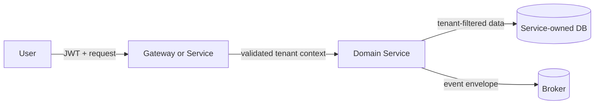

# EKSAD Generic Threat Model Template

> Filename: `{PROJECT_CODE}_THREAT_MODEL_{SCOPE}_v{VERSION}.md`
> Owner: System Analyst; SA or TL coordinates and invokes the assigned security review function.
> A threat model documents credible abuse and treatment. It does not itself accept residual risk.

# {PROJECT_NAME} — Threat Model: {SCOPE}

## Document Control

| Field | Value |
|---|---|
| Version | {VERSION} |
| Status | Draft / In Review / Complete / Superseded |
| Scope / Services | {SCOPE} |
| Target source/design ref | {COMMIT_TSD_ADR_REFERENCE} |
| Data classification | {CLASSIFICATION} |
| Model owner | {NAME_ROLE} |
| Assigned security review function | {ASSIGNEE_OR_FUNCTION_REFERENCE} |
| Residual-risk authority | {NAME_ROLE} |
| Created / Updated | {DATE} / {DATE} |
| Next review trigger/date | {TRIGGER_OR_DATE} |

## Revision History

| Version | Date | Author | Change / trigger |
|---|---|---|---|
| 0.1 | {DATE} | {AUTHOR} | Initial model |

## 1. Scope and Security Objectives

### 1.1 In Scope / Out of Scope

- In scope: {COMPONENTS_APIS_EVENTS_DATA_STORES_ENVIRONMENTS}
- Out of scope: {EXCLUSIONS_AND_OWNER}

### 1.2 Related Sources

| Source | ID / version / location | Relevance |
|---|---|---|
| BRD/FSD/NFR | {REFERENCE} | {SECURITY_DRIVER} |
| TSD/Architecture/ADR | {REFERENCE} | {DESIGN_BOUNDARY} |
| API/event/data contract | {REFERENCE} | {SURFACE} |
| Prior review/test/scan | {REFERENCE} | {EVIDENCE_AND_DATE} |

### 1.3 Security Objectives

- Preserve tenant isolation and object ownership: {DETAIL}
- Enforce authenticated identity and least privilege: {DETAIL}
- Protect confidentiality/integrity/availability of classified assets: {DETAIL}
- Preserve attributable, non-secret-bearing audit evidence: {DETAIL}
- Additional objective: {DETAIL}

## 2. Assets

| Asset / operation | Classification / tenant scope | Security objective | Business impact | Owner |
|---|---|---|---|---|
| {ASSET} | {CLASSIFICATION} | Confidentiality / Integrity / Availability / Accountability | {IMPACT} | {OWNER} |

## 3. Actors and Capabilities

| Actor | Trusted / untrusted context | Legitimate capability | Potential attacker capability / constraint |
|---|---|---|---|
| End user / tenant user | {CONTEXT} | {CAPABILITY} | {CAPABILITY} |
| Privileged/admin/support user | {CONTEXT} | {CAPABILITY} | {CAPABILITY} |
| Service/workload identity | {CONTEXT} | {CAPABILITY} | {CAPABILITY} |
| External/third-party system | {CONTEXT} | {CAPABILITY} | {CAPABILITY} |
| Anonymous/internet actor | Untrusted | {CAPABILITY_OR_NONE} | {CAPABILITY} |
| Dependency/build contributor | Supply-chain boundary | {CAPABILITY} | {CAPABILITY} |

## 4. Components, Data Flows, and Trust Boundaries

### 4.1 Component Inventory

| ID | Component / store | Responsibility | Identity | Data handled | Exposure |
|---|---|---|---|---|---|
| C-01 | {COMPONENT} | {RESPONSIBILITY} | {IDENTITY} | {DATA} | Internal / External |

### 4.2 Data Flow Diagram

> Replace the example with the actual system. Show protocols, identities, tenant context, sensitive data, async consumers, admin/support paths, file storage, and external integrations.

### 4.3 Trust Boundaries

| Boundary ID | From → To | Why trust changes | Authentication | Authorization / tenant control | Protection / validation | Evidence |
|---|---|---|---|---|---|---|
| TB-01 | {SOURCE_TO_TARGET} | {CHANGE} | {CONTROL} | {CONTROL} | {CONTROL} | {REFERENCE} |

### 4.4 Entry/Exit Points

| Point | Input/output | Caller/consumer | Validation/control | Rate/abuse control | Logging/redaction |
|---|---|---|---|---|---|
| {API_EVENT_FILE_JOB} | {DATA} | {ACTOR} | {CONTROL} | {CONTROL} | {CONTROL} |

## 5. Abuse Paths and Threats

> Trace actor → entry point → boundary/control condition → asset/operation → impact. Avoid generic labels without a reachable path.

| Threat ID | Actor and preconditions | Abuse path | Asset / impact | Existing controls and evidence | Gap | Likelihood | Impact | Confidence |
|---|---|---|---|---|---|---|---|---|
| TM-{SCOPE}-001 | {ACTOR_PRECONDITION} | {REACHABLE_PATH} | {ASSET_IMPACT} | {CONTROL_REFERENCE} | {GAP} | Low / Medium / High | Low / Medium / High | High / Medium / Low |

## 6. Required Control Review

| Control area | Design / implementation | Evidence | Status | Gap / owner |
|---|---|---|---|---|
| JWT/session/service identity | {DETAIL} | {REFERENCE} | Effective / Partial / Missing / Unknown | {OWNER} |
| RBAC/object ownership/tenant filtering | | | | |
| Input, parser, upload, and output safety | | | | |
| API/event authenticity, replay, and abuse limits | | | | |
| Sensitive data, logs, secrets, and cryptography | | | | |
| Audit/detection/alerting/containment | | | | |
| Dependencies, images, plugins, and package sources | | | | |

## 7. Dependency and Supply-Chain Exposure

| Component | Purpose / necessity | Source and pinned identity | Provenance / vulnerability / license evidence | Build/runtime privilege | Upgrade/rollback owner | Disposition |
|---|---|---|---|---|---|---|
| {DEPENDENCY_IMAGE_PLUGIN} | {PURPOSE} | {SOURCE_VERSION_DIGEST} | {REFERENCE_DATE} | {PRIVILEGE} | {OWNER} | Keep / Upgrade / Replace / Remove / Investigate |

## 8. Mitigation and Validation Plan

| Threat ID | Treatment | Mitigation / compensating control | Owner | Due | Validation method/evidence | Residual risk |
|---|---|---|---|---|---|---|
| {ID} | Mitigate / Avoid / Transfer / Await acceptance | {ACTION} | {OWNER} | {DATE} | {TEST_REVIEW_REFERENCE} | {RISK} |

## 9. Findings

Use existing EKSAD severity labels unchanged. Confidence is independent from severity.

| Finding ID | Severity | Confidence | Exact location | Evidence and reachable path | Impact | Required fix / verification | Owner/status |
|---|---|---|---|---|---|---|---|
| SEC-{SCOPE}-001 | 🔴 BLOCKER / 🟠 MAJOR / 🟡 MINOR / 🟢 NIT | High / Medium | {LOCATION} | {EVIDENCE} | {IMPACT} | {ACTION} | {OWNER_STATUS} |

### Investigation Items (not findings)

| Item | Why confidence is low / evidence missing | Owner | Due |
|---|---|---|---|
| {QUESTION} | {DETAIL} | {OWNER} | {DATE} |

### Suppressed Candidates (optional audit record)

| Candidate | Suppression reason | Compensating evidence |
|---|---|---|
| {CANDIDATE} | Unreachable / effective boundary control / non-shipping code / unsupported generic claim | {REFERENCE} |

## 10. Residual-Risk Decision

| Risk / threat IDs | Recommendation | Named authority | Decision | Conditions / expiry | Evidence |
|---|---|---|---|---|---|
| {IDS} | Mitigate / Avoid / Transfer / Seek acceptance | {NAME_ROLE} | Awaiting / Accepted / Rejected / Expired | {DETAIL} | {REFERENCE} |

> Reviewer recommendation is not risk acceptance. A waiver remains distinct from pass and must be scoped, authorized, evidenced, and time-bound.

## 11. Separate Verdict Dimensions

Determine **Security implementation** in this precedence order: `FAIL` for any confirmed unresolved BLOCKER/MAJOR or evidenced missing/ineffective mandatory control; otherwise `BLOCKED` when mandatory scope/evidence/access/retest is insufficient to decide safely; otherwise `PASS WITH FINDINGS` when only unresolved MINOR/NIT findings remain; otherwise `PASS` when review is complete, mandatory controls are evidenced effective, and no findings remain. Use `NOT REVIEWED` only when no implementation review occurred. Waivers and residual-risk decisions remain separate and never change this verdict.

| Dimension | Result | Basis / evidence |
|---|---|---|
| Security implementation | PASS / PASS WITH FINDINGS / FAIL / BLOCKED / NOT REVIEWED | {REFERENCE} |
| Threat-model completeness | COMPLETE / PARTIAL / MISSING / NOT REQUIRED | {REFERENCE_OR_JUSTIFICATION} |
| Residual-risk decision | NOT REQUIRED / AWAITING AUTHORITY / ACCEPTED / REJECTED / EXPIRED | {AUTHORITY_REFERENCE} |

## 12. Review and Closure

| Trigger/action | Owner | Expected evidence | Date/condition | Status |
|---|---|---|---|---|
| Mitigation retest | {OWNER} | {EVIDENCE} | {DATE} | Pending |
| Architecture/dependency/data-boundary change review | {OWNER} | Updated model | {TRIGGER} | Pending |
| Residual-risk expiry review | {AUTHORITY} | New decision | {DATE} | Pending |

Closure statement: {WHAT_WAS_REVIEWED, WHAT_REMAINS_OPEN, AND WHO_HAS_AUTHORITY}.

> **Template use:** Copy this file to the approved security-design path, rename it `{PROJECT_CODE}_THREAT_MODEL_{SCOPE}_v{VERSION}.md`, replace placeholders, and keep this generic template free of project-specific completed content.
