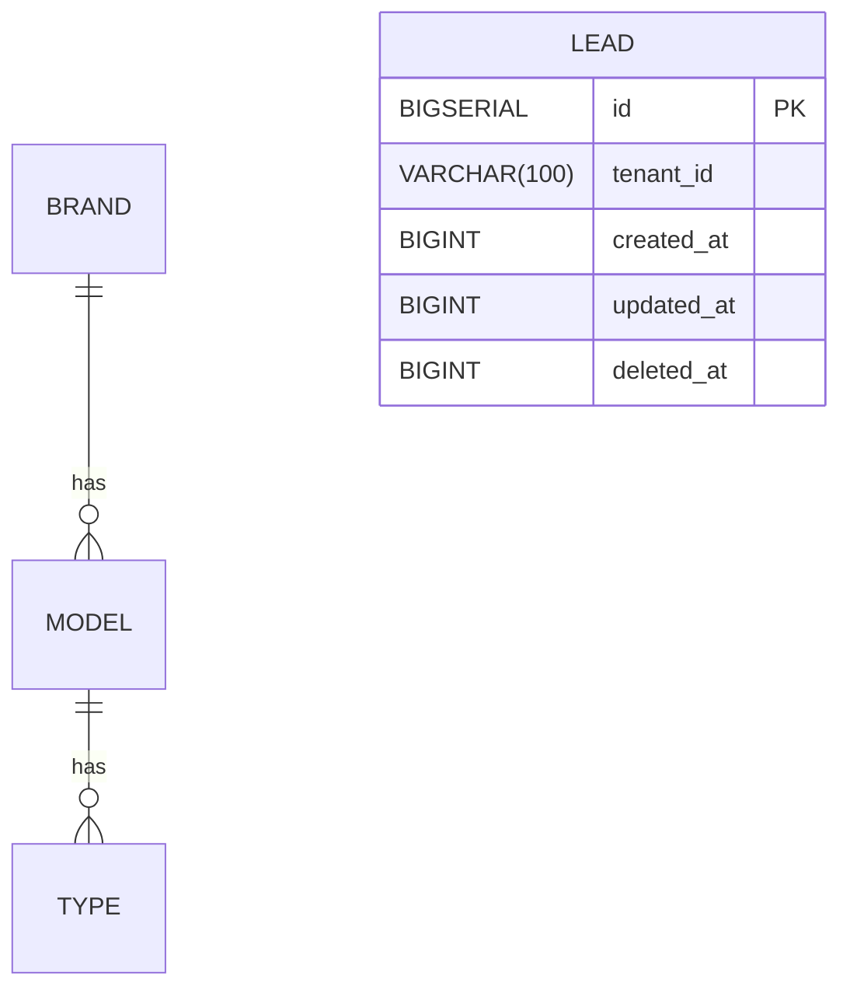

# EKSAD TSD Design Skill

Technical Specification Document workflow for EKSAD System Analyst work. Produces TSD with stack profile decision, complete Flyway DDL, API contracts, RabbitMQ event schemas, and code skeletons.

## When to Use

- User asks to write a TSD for a new or existing service
- User asks for stack profile decision (Framework × Paradigm × Broker)
- User wants Flyway DDL for an entity
- User wants API contract design
- User wants RabbitMQ event schema design
- User wants to review an existing TSD

## When NOT to Use

- Business-level requirement → switch to `business-analyst` profile + `eksad-ba-workflow` skill
- Code implementation → switch to `developer-backend` or `developer-frontend` profile
- Code review → switch to `technical-leader` profile

## Knowledge References (read before starting)

Primary:
- `~/.hermes/knowledge/eksad/EKSAD/gpt/_base/EKSAD_BASE_PRINCIPLES.md` — 14 principles, tech stack, DDL standards, API catalog, event envelope
- `~/.hermes/knowledge/eksad/EKSAD/gpt/_base/EKSAD_DOMAIN_REGISTRY.md` — 🔴 P0 domain map, port registry
- `~/.hermes/knowledge/eksad/EKSAD/gpt/_base/EKSAD_SYSTEM_DESIGN_PATTERNS.md` — architecture patterns

Templates:
- `~/.hermes/knowledge/eksad/EKSAD/gpt/_template/EKSAD_GENERIC_TSD_TEMPLATE.md` — TSD structure (source of truth)
- `~/.hermes/knowledge/eksad/EKSAD/gpt/_template/EKSAD_GENERIC_FE_TSD_TEMPLATE.md` — FE-TSD structure
- `~/.hermes/knowledge/eksad/EKSAD/gpt/_template/EKSAD_ARCHITECTURE_DOC_TEMPLATE.md` — project ARCHITECTURE.md
- `~/.hermes/knowledge/eksad/EKSAD/gpt/_template/EKSAD_GENERIC_ADR_TEMPLATE.md` — material architecture decision record
- `~/.hermes/knowledge/eksad/EKSAD/gpt/_template/EKSAD_GENERIC_THREAT_MODEL_TEMPLATE.md` — trust-boundary and abuse-path model

Governance workflows:
- `~/.hermes/knowledge/eksad/hermes-skills/technical-design/eksad-adr-workflow/SKILL.md` — ADR triggers, decision authority, lifecycle, and supersession
- `~/.hermes/knowledge/eksad/hermes-skills/security/eksad-appsec-review/SKILL.md` — AppSec review and threat-model workflow

Specific patterns:
- `~/.hermes/knowledge/eksad/EKSAD/gpt/_base/EKSAD_CRUDFLOWS_PATTERN.md` — CrudFlows v2 reactive
- `~/.hermes/knowledge/eksad/EKSAD/gpt/_base/EKSAD_CRUDFLOWS_JPA.md` — CrudFlows v2 blocking
- `~/.hermes/knowledge/eksad/EKSAD/gpt/_base/EKSAD_SPRING_BOOT_MAPPINGS.md` — when SB project
- `~/.hermes/knowledge/eksad/EKSAD/gpt/_base/EKSAD_CODING_STANDARDS.md` — code reference (read-only)
- `~/.hermes/knowledge/eksad/EKSAD/gpt/_base/EKSAD_MASTER_DATA_PATTERNS.md`
- `~/.hermes/knowledge/eksad/EKSAD/gpt/_base/EKSAD_CACHE_SYNC_PATTERNS.md`
- `~/.hermes/knowledge/eksad/EKSAD/gpt/_base/EKSAD_EVENT_CATALOG.md`
- `~/.hermes/knowledge/eksad/EKSAD/gpt/_base/EKSAD_MULTI_TENANCY_PATTERNS.md`
- `~/.hermes/knowledge/eksad/EKSAD/gpt/_base/EKSAD_CORE_AUTH_PATTERNS.md`
- `~/.hermes/knowledge/eksad/EKSAD/gpt/_base/EKSAD_RESERVED_FIELD_PATTERNS.md`
- `~/.hermes/knowledge/eksad/EKSAD/gpt/_base/EKSAD_RESILIENCE_PATTERNS.md`
- `~/.hermes/knowledge/eksad/EKSAD/gpt/_base/EKSAD_OBSERVABILITY_PATTERNS.md`
- `~/.hermes/knowledge/eksad/EKSAD/gpt/_base/EKSAD_DB_DEPLOYMENT_STRATEGY.md`

## Pre-Design Checklist

Before designing, confirm with user:
- [ ] Do you have BRD/FSD to work from? (or are you designing greenfield?)
- [ ] Service name and domain?
- [ ] What port? (check `EKSAD_DOMAIN_REGISTRY.md §8`)
- [ ] Does this service have an approval workflow?
- [ ] What other EKSAD services does it communicate with?
- [ ] **Stack Profile**: Framework × Paradigm × Broker (record in TSD §3.1)
- [ ] Does the design cross/change a trust boundary, identity, tenant, sensitive-data, file, external-integration, or privileged-operation boundary?
- [ ] Does a material choice require an ADR under the triggers below?
- [ ] What telemetry proves healthy behavior, and who owns each signal/alert?
- [ ] What migration, compatibility, rollback, and data-recovery constraints apply?

## Governance Checkpoints

### ADR Decision Trigger and Lifecycle

Use `eksad-adr-workflow` and `EKSAD_GENERIC_ADR_TEMPLATE.md` when a choice has multiple viable options with material trade-offs; changes service/data ownership, stack profile, broker, gateway, tenancy, trust boundary, shared contract, external dependency, or migration strategy; creates an expensive/irreversible commitment; requests an EKSAD exception; or supersedes a prior decision.

Do not create an ADR for a routine implementation detail already fixed by an accepted EKSAD standard. Link every applicable ADR from the TSD decision log and record its actual lifecycle state:

Allowed transitions: `Proposed → In Review`; `In Review → Accepted` or `Rejected`; and `Accepted → Superseded` or `Deprecated`. `Rejected`, `Superseded`, and `Deprecated` are terminal. `Superseded` requires an accepted successor ADR and bidirectional links; a materially revised rejected proposal receives a new ADR ID.

Only the named decision authority may mark an ADR `Accepted` or `Rejected`. Author recommendation is not approval. Changed accepted decisions require a successor ADR and bidirectional supersession links; do not rewrite history. A TSD cannot treat a `Proposed`, `In Review`, or missing ADR as an approved baseline.

### Trust-Boundary and Security-Design Checkpoint

Before locking APIs, events, storage, tenancy, identity, or deployment topology:

- identify assets/data classification, human/service/external actors, entry/exit points, data flows, and every trust boundary;
- show where JWT/service identity is validated, where tenant context originates and is enforced, where privilege changes, and where untrusted data is parsed or stored;
- trace credible abuse paths through API, event consumer, scheduled/admin/support, file, callback/webhook, and external dependency paths;
- map preventive, detective, and recovery controls to owners and evidence.

For changed authentication/authorization/tenant isolation, sensitive data, external integrations, files/parsers, cryptography/secrets, privileged flows, dependencies/supply chain, or any material trust boundary, any role may raise the trigger and supply evidence; the SA or TL coordinates and invokes the shared `eksad-appsec-review` workflow and creates/updates `EKSAD_GENERIC_THREAT_MODEL_TEMPLATE.md`. AppSec is not a profile. If review is not required, record the evidence-based reason in the TSD. The SA owns design content; only the named risk authority accepts residual risk or grants a waiver.

### Observability, Migration, and Rollback Design Gate

The TSD is not design-complete until it records:

| Check | Required design evidence |
|---|---|
| Observability | Golden/critical-path signals; business/audit events; structured logs with correlation and redaction; metrics/traces; health/readiness; alert threshold source, owner, runbook, and validation method |
| Failure behavior | Dependency timeout/retry/circuit-breaker/idempotency behavior; degraded mode; queue/DLQ handling; capacity/back-pressure; user-visible behavior |
| Migration | Current/target state; Flyway sequence; expand/contract and mixed-version compatibility; backfill/reconciliation; tenant impact; backup/restore prerequisite; owner and validation evidence |
| Rollback | Explicit trigger and decision owner; application/config/artifact rollback; DB/event/API compatibility; treatment of irreversible data changes; recovery/RTO-RPO source; post-rollback verification |

Never claim rollback when a destructive or incompatible migration makes it impossible. State the forward-recovery path and authority instead. Never invent thresholds, RTO/RPO, or observation periods; cite approved requirements or mark `TBD — Owner — Due Date`.

## Design Order (10 Steps)

### 1. Architecture Overview
Where service fits in the platform. Service registry entry. Dependencies (which `eksad-core-*` modules).

### 2. POM Dependencies
```xml
<parent>
  <groupId>com.eksad.platform</groupId>
  <artifactId>eksad-parent</artifactId>
</parent>
```
Service-specific dependencies. `eksad-core-*` selection:
- Quarkus reactive → `eksad-core-api` + `eksad-core-reactive` (+ `eksad-core-quarkus-starter`)
- Quarkus imperative → `eksad-core-api` + `eksad-core-jpa` + starter
- Spring Boot → `eksad-core-api` + `eksad-core-jpa` + `eksad-core-spring-boot-starter`

### 3. Project Package Structure
Per `EKSAD_CODING_STANDARDS.md §2`:
```
com.eksad.svc.{domain}.{common, core, data, transport}
```

### 4. Docker Compose Additions
Local dev infra. PostgreSQL, RabbitMQ, MongoDB (if needed). Network + volumes.

### 5. JWT Config
Claims needed: `tenant_id`, `role`, `user_id`, `permissions`. JWKS endpoint from `eksad-core-auth`. Validate via `mp.jwt.verify.publickey.location`.

### 6. application.properties Template
Required env vars:
- `RABBITMQ_HOST`, `RABBITMQ_PORT`, `RABBITMQ_USERNAME`, `RABBITMQ_PASSWORD`
- DB connection (PG)
- `STORAGE_*` (if file upload)
- `AUDIT_*` (if direct Kafka emit)

**Forbidden:** `quarkus.hibernate-orm.database.generation=update` or `ddl-auto=update`

### 7. Flyway DDL (full)
For each table, full column definitions:
```sql
CREATE TABLE {table_name} (
    id          BIGSERIAL PRIMARY KEY,
    tenant_id   VARCHAR(100) NOT NULL,
    -- ... domain columns
    deleted_at  BIGINT NULL,
    deleted_by  VARCHAR(100) NULL,
    created_at  BIGINT NOT NULL,
    created_by  VARCHAR(100) NOT NULL,
    updated_at  BIGINT NULL,
    updated_by  VARCHAR(100) NULL
);

CREATE INDEX idx_{table}_tenant_id ON {table} (tenant_id);
CREATE INDEX idx_{table}_deleted_at ON {table} (deleted_at);
CREATE INDEX idx_{table}_created_at ON {table} (created_at);
-- indexes on filter/FK columns
```

Reserved fields (if transactional entity opting in):
```sql
-- Per EKSAD_RESERVED_FIELD_PATTERNS.md §9
reserved_string_1  VARCHAR(255) NULL,
-- ... 5 string + 3 numeric + 2 date + 2 boolean + 1 JSONB
```

Master data / cache / audit tables: **NO reserved fields** (exempt).

### 8. RabbitMQ Schemas
For custom domain events (beyond audit trail):
- Exchange name: `exc-{domain}`
- Queue name: `q-{action}-{service}`
- Routing key: `r.q-{action}-{service}`
- Event envelope per `EKSAD_BASE_PRINCIPLES.md` (eventType, eventId, tenantId, actorId, actorName, occurredAt, serviceId, payload)

For dual-broker (Kafka opt-in), see `EKSAD_EVENT_CATALOG.md §6, §11.2`.

### 9. Code Skeletons (SIGNATURES ONLY — NO method bodies)

#### Entity
```java
@Data @SuperBuilder @NoArgsConstructor
@Entity @Table(name = "{table_name}")
public class {Entity}Entity extends {BaseEntity | BaseTransactionalEntity} {
    @Id @GeneratedValue(strategy = GenerationType.IDENTITY)
    private Long id;

    @Column(name = "tenant_id", nullable = false)
    private String tenantId;
    // ... domain fields
}
```

#### Module Type (paired interfaces)
```java
public interface {Entity}ModuleType {
    String PREFIX = "EKSAD_SVC_{DOMAIN_UPPER}";
    interface {ENTITY} {
        String CREATE = PREFIX + ".{ENTITY}.CREATE";
        String UPDATE = PREFIX + ".{ENTITY}.UPDATE";
        String DELETE = PREFIX + ".{ENTITY}.DELETE";
        // ... additional actions
    }
}
```

#### Repository
```java
@ApplicationScoped
public class {Entity}Repository extends BaseRepository<{Entity}Entity, {Entity}DTO, Long> {
    // method signatures only
}
```

#### Service + Resource
Signature only. **NO implementation body.**

### 9.5. ERD Conventions (Mermaid `erDiagram`)

**When to produce standalone ERD vs embed in TSD:**

| Project size | ERD location |
|--------------|--------------|
| < 5 entities | Embed in TSD §7 (Data Model) as a single `erDiagram` block |
| 5-15 entities | Standalone ERD doc (`ERD_<service>_v1.0.md`) + brief reference in TSD |
| 15+ entities | Standalone ERD per bounded context + master data ERD |

**Mermaid `erDiagram` syntax reference:**



EKSAD type shorthand: `BIGSERIAL` (autoincrement), `BIGINT` (epoch ms), `VARCHAR(100)` (tenant_id), `VARCHAR(255)` (string), `NUMERIC(20,4)` (money), `BOOLEAN`, `JSONB`.

**EKSAD-specific ERD rules (apply to every entity):**

1. **Every entity has 7 audit columns**: `id BIGSERIAL PK`, `tenant_id VARCHAR(100)`, `created_at BIGINT`, `created_by VARCHAR(100)`, `updated_at BIGINT NULL`, `updated_by VARCHAR(100) NULL`, `deleted_at BIGINT NULL`, `deleted_by VARCHAR(100) NULL`
2. **Master data entities** (in `svc-master-data`): annotate with comment `<<master>>` in ERD
3. **Cache tables** (denormalized from master data): suffix with `_cache`, annotate `<<cache>>`
4. **Transactional entities opting into reserved fields**: add 13 columns per `EKSAD_RESERVED_FIELD_PATTERNS.md` (5 string, 3 numeric, 2 date, 2 boolean, 1 JSONB). Note in ERD comment.
5. **Indexes** (not shown in ERD by default — list in TSD §7): `tenant_id`, `deleted_at`, `created_at`, plus all FK + filter columns
6. **Cross-service relationships**: NEVER show in ERD. Note as integration point.

**Worked example (used-car `Lead` entity):**

```mermaid
erDiagram
    BRAND ||--o{ MODEL : "has"
    MODEL ||--o{ TYPE : "has"
    BRAND ||--o{ LEAD : "interested_in"
    USER ||--o{ LEAD : "owns"

    BRAND {
        BIGSERIAL id PK
        VARCHAR(100) tenant_id
        VARCHAR(100) name
        BIGINT created_at
    }
    MODEL {
        BIGSERIAL id PK
        VARCHAR(100) tenant_id
        BIGINT brand_id FK
        VARCHAR(100) name
        BIGINT created_at
    }
    TYPE {
        BIGSERIAL id PK
        VARCHAR(100) tenant_id
        BIGINT model_id FK
        VARCHAR(100) name
        BIGINT created_at
    }
    LEAD {
        BIGSERIAL id PK
        VARCHAR(100) tenant_id
        BIGINT brand_id FK
        BIGINT model_id FK
        BIGINT type_id FK
        BIGINT user_id FK
        VARCHAR(100) name
        VARCHAR(20) status "DRAFT|SUBMITTED|APPROVED|REJECTED"
        NUMERIC(20,4) budget
        BIGINT created_at
        BIGINT submitted_at
    }
    USER {
        BIGSERIAL id PK
        VARCHAR(100) tenant_id
        VARCHAR(100) username
        VARCHAR(255) email
        BIGINT created_at
    }
```

**Forbidden in ERD:**

❌ `VARCHAR(N)` without explicit size — always specify
❌ Foreign keys to entities in other services (cross-service JOIN forbidden)
❌ Many-to-many without junction table
❌ Surrogate keys when natural key exists
❌ Hide audit columns to "reduce clutter" — they're mandatory, always show

### 9.6. API Contract Design

**When to produce standalone API Contract doc vs embed in TSD:**

| Scenario | API Contract location |
|----------|------------------------|
| 1 service in TSD | Embed in TSD §5 (API Catalog) — already covered |
| 2+ services (same bounded context) | Standalone per service (`API_<service>_v1.0.md`) |
| Microservices with public contracts | Standalone + OpenAPI YAML per service |
| Frontend integration contracts | Standalone `API_FE_CONTRACT.md` (per `EKSAD_GENERIC_FE_TSD_TEMPLATE.md`) |

**API Catalog Table format (from `EKSAD_BASE_PRINCIPLES.md`):**

| Method | Path | Auth Role | Request Body | Response | Module Type | Description |
|--------|------|-----------|--------------|----------|-------------|-------------|
| POST | `/api/v1/leads` | `ROLE_SUBMITTER`, `ROLE_ADMIN` | `{LeadCreateDTO}` | `{LeadResponseDTO}` | `EKSAD_SVC_LEADS.LEAD.CREATE` | Create new lead |
| GET | `/api/v1/leads/{id}` | `ROLE_VIEWER`, `ROLE_ADMIN` | — | `{LeadResponseDTO}` | `EKSAD_SVC_LEADS.LEAD.READ` | Get lead by ID |
| GET | `/api/v1/leads` | `ROLE_VIEWER`, `ROLE_ADMIN` | query: `?page&size&status` | `{LeadResponseDTO[]}` + `PageMetadata` | `EKSAD_SVC_LEADS.LEAD.LIST` | List leads (paginated) |
| PUT | `/api/v1/leads/{id}` | `ROLE_SUBMITTER` (own), `ROLE_ADMIN` | `{LeadUpdateDTO}` | `{LeadResponseDTO}` | `EKSAD_SVC_LEADS.LEAD.UPDATE` | Update lead |
| DELETE | `/api/v1/leads/{id}` | `ROLE_ADMIN` | — | `{ApiResponse<void>}` | `EKSAD_SVC_LEADS.LEAD.DELETE` | Soft delete lead |
| POST | `/api/v1/leads/{id}/submit` | `ROLE_SUBMITTER` (own) | — | `{LeadResponseDTO}` | `EKSAD_SVC_LEADS.LEAD.SUBMIT` | Submit for approval |

**OpenAPI 3.0 / Swagger mapping (EKSAD → OpenAPI extensions):**

```yaml
openapi: 3.0.3
info:
  title: EKSAD Lead Service API
  version: 1.0.0
paths:
  /api/v1/leads:
    post:
      tags:
        - leads
      x-module-type: EKSAD_SVC_LEADS.LEAD.CREATE
      operationId: createLead
      security:
        - bearerAuth: [ROLE_SUBMITTER, ROLE_ADMIN]
      requestBody:
        required: true
        content:
          application/json:
            schema:
              $ref: '#/components/schemas/LeadCreateDTO'
      responses:
        '201':
          description: Created
          content:
            application/json:
              schema:
                $ref: '#/components/schemas/ApiResponse_LeadResponseDTO'
        '422':
          $ref: '#/components/responses/ValidationError'
        '401':
          $ref: '#/components/responses/Unauthorized'
components:
  schemas:
    LeadCreateDTO:
      type: object
      required: [name, brandId, modelId, typeId]
      properties:
        name: { type: string, maxLength: 100 }
        brandId: { type: integer, format: int64 }
        modelId: { type: integer, format: int64 }
        typeId: { type: integer, format: int64 }
        budget: { type: string, pattern: '^\d+(\.\d{1,4})?$' }  # BigDecimal as string
    ApiResponse_LeadResponseDTO:
      type: object
      required: [status, message, data]
      properties:
        status: { type: string, enum: [SUCCESS, FAIL] }
        message: { type: string }
        data: { $ref: '#/components/schemas/LeadResponseDTO' }
        metadata: { $ref: '#/components/schemas/PageMetadata' }
```

**EKSAD OpenAPI extensions (custom `x-` fields):**

| OpenAPI field | EKSAD meaning |
|---------------|---------------|
| `x-module-type` | Maps to audit trail module type string (e.g., `EKSAD_SVC_LEADS.LEAD.CREATE`) |
| `x-tenant-isolation` | `true` if endpoint automatically filters by caller's `tenant_id` |
| `x-reserved-fields` | `true` if entity uses Reserved Fields pattern (13 columns) |
| `x-soft-delete` | `true` if DELETE is soft delete (always true per EKSAD) |
| `x-stack-profile` | Stack profile used (e.g., `quarkus-reactive-rabbitmq`) |

**Request/Response DTO naming conventions:**

- Request: `{Entity}CreateDTO`, `{Entity}UpdateDTO`, `{Entity}FilterDTO`
- Response: `{Entity}ResponseDTO`
- List: `{Entity}ResponseDTO[]` + `PageMetadata` in wrapper
- Single field responses: `{Entity}ActionResponseDTO` (e.g., for state transitions)

**Error response patterns (EKSAD standard):**

| HTTP | EKSAD exception | Use when |
|------|-----------------|----------|
| 400 | `BadRequestException` | Malformed request body, missing required field |
| 401 | `UnauthorizedException` | No JWT, expired JWT, invalid signature |
| 403 | `ForbiddenException` | Valid JWT but wrong role, wrong tenant, no permission |
| 404 | `NotFoundException` | Entity not found OR soft-deleted |
| 409 | `ConflictException` | Unique constraint violation, state conflict |
| 422 | `ValidationException` | Business rule violation, guard failed, reserved field invalid |
| 500 | Internal error | System error (logged + audit) |

**Error response body (consistent across all EKSAD APIs):**

```json
{
  "status": "FAIL",
  "message": "Lead cannot be submitted in current status DRAFT",
  "data": null,
  "metadata": null,
  "error": {
    "code": "VALIDATION_FAILED",
    "field": "status",
    "details": "Current status: DRAFT. Required: SUBMITTED or APPROVED."
  }
}
```

**Standalone API Contract doc template:**

```markdown
# API Contract — <Service Name>

**Service:** <svc-name>
**Stack Profile:** <quarkus-reactive-rabbitmq>
**Version:** <v1.0>
**Date:** <YYYY-MM-DD>
**Status:** <Draft / Approved / Active>

---

## 1. Overview
[Brief description of service's API surface]

## 2. Authentication & Authorization
- All endpoints require JWT (HttpOnly cookie or Bearer, per EKSAD §12)
- Roles: list applicable roles
- Tenant isolation: every query filters by `tenant_id`

## 3. API Catalog
[Insert full API catalog table here]

## 4. OpenAPI Specification
[Insert OpenAPI YAML or link to /openapi.json endpoint]

## 5. Request/Response Schemas
[Per DTO — table or YAML block]

## 6. Error Codes
[Insert error response patterns table]

## 7. State Machine Endpoints
[For state-transition endpoints (submit/approve/reject), include state diagram]

## 8. Pagination Conventions
- Query: `?page=0&size=20`
- Response: `metadata: { totalCount, totalPages, page, size, hasNext, hasPrevious }`

## 9. Versioning
- URI versioning: `/api/v1/...`, `/api/v2/...`
- Backward compat within major version

## 10. Examples
[Curl examples for each endpoint]
```

**Forbidden in API Contract:**

❌ Expose entity classes directly (always DTOs)
❌ `String` for money fields (use `BigDecimal` JSON or numeric type)
❌ Return raw exceptions with stack traces
❌ Mix business and technical error codes
❌ Skip `x-module-type` for audit-relevant endpoints
❌ Use HTTP status codes that don't match EKSAD exception table

### 10. Testing Strategy
- Unit tests (Mockito)
- Integration tests (QuarkusTest + Testcontainers)
- Auth scenarios (401/403)
- State machine matrix
- Audit trail verification

## Quick Design Standards (Non-Negotiable)

| Standard | Rule |
|----------|------|
| Every table | Has `tenant_id`, `deleted_at`, `deleted_by`, `created_at`, `created_by`, `updated_at`, `updated_by` |
| Transactional entity with reserved fields | Extends `BaseTransactionalEntity` (NOT `BaseEntity`) |
| All timestamps | `BIGINT` (epoch ms), never `TIMESTAMP`/`Date`/`LocalDateTime` |
| All financial amounts | `NUMERIC(20,4)` + Java `BigDecimal` |
| Every endpoint | Has `@RolesAllowed` |
| Every audit operation | Uses `BaseRepository` flow methods |
| Service naming | `svc-{function}` — NEVER business jargon (`svc-spk`, `svc-leads`) |
| Fixed service names | NEVER renamed: `eksad-core-*`, `svc-user-management`, `svc-tenant-management`, `svc-master-data` |
| Code skeletons | Class structure + method signatures ONLY — no method bodies |
| JWT validation | Per-service via JWKS from `eksad-core-auth` (gateway optional per D13) |

## Output Pattern

Each section: narrative paragraph → table/code/diagram → standards check

## Commit Pattern

```bash
cd /workspace/projects/<project>
git add TSD/<file>.md
git commit -m "docs(TSD): <change>"
git push
```

## Anti-Patterns

❌ Design cross-service database JOINs
❌ Use `FLOAT`/`VARCHAR` for money
❌ Use `TIMESTAMP`/`Date`/`LocalDateTime` for DB columns
❌ Omit `tenant_id` from any table
❌ Omit `deleted_at`/`deleted_by`
❌ Design CRUD without `BaseRepository` flow methods
❌ Leave `{PLACEHOLDER}` in delivered document
❌ Create transactional entity extending `BaseEntity` (should be `BaseTransactionalEntity` if opt-in reserved fields)
❌ Design service without JWT validation capability
❌ Use business jargon in service names
❌ Rename fixed-name services (`svc-master-data`, etc.)
❌ Provide full method body implementations in TSD (signatures only)
