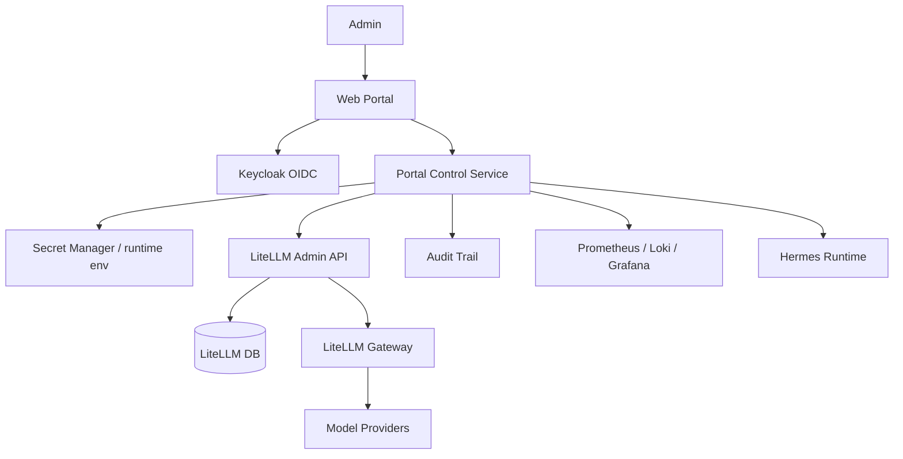

# Future Alignment Plan — Web Portal Control Plane

**Status:** Future candidate / parked backlog  
**Created:** 2026-07-16  
**Source:** EKSAD AI Software Factory architecture baseline v1.0 + Web Portal User Requirements draft v1.0  
**Scope type:** Git source-of-truth planning, not runtime activation  
**Runtime mutation policy:** Do not deploy Web Portal, mutate Keycloak, create LiteLLM keys, store provider keys, or change live Hermes/LiteLLM/RAG runtime from this plan without a separate explicit approval gate.

---

## 1. Why this is a future plan, not the next numbered phase

The Web Portal is strategically aligned with the EKSAD AI Software Factory architecture, but it should remain a **future alignment plan** until the current agentic knowledge source-of-truth stream is reviewed/merged and the next active improvement is explicitly chosen.

Do **not** reserve labels such as Phase G/H/I/J for this plan. Future work may insert other improvement phases first.

Use neutral workstream IDs instead:

| Workstream | Name | Intent |
|---|---|---|
| WPC-01 | Portal Control Plane Source-of-Truth | Add portal domain docs/contracts to Git. |
| WPC-02 | Portal BA/SA Specification Pack | Convert UR into BRD/FSD/TSD/API/ADR pack. |
| WPC-03 | LiteLLM Runtime Blueprint | Define non-prod integration blueprint for virtual keys, budgets, routing, fallback, and audit. |
| WPC-04 | Controlled Pilot and Hardening | Prove the flow safely in non-prod before production hardening. |

---

## 2. Architecture alignment assessment

The Web Portal described in the architecture and UR is **inline** with the EKSAD AI Software Factory harness.

It fits as the front-door/control-plane experience layer:

```text
Users / Stakeholders
  -> Web Portal / Chat / Telegram / Keycloak
  -> Hermes role-agent runtime
  -> MCP tools + RAG system
  -> LiteLLM gateway
  -> model providers
  -> platform backbone, observability, artifact storage
```

The Web Portal should **not** replace Hermes, RAG, or LiteLLM:

| Component | Responsibility |
|---|---|
| Web Portal | Cockpit UI, admin control panel, project workspace, approval, monitoring, runtime control-plane requests. |
| Keycloak | OIDC login, SSO, RBAC claims, account linking. |
| Hermes | Role-agent runtime/orchestrator and stage-gated agent execution. |
| RAG API / Milvus / MinIO | Knowledge retrieval, citations, evidence, artifacts. |
| LiteLLM | Provider routing, virtual keys, budget/rate limits, fallback, spend tracking. |
| Git source-of-truth | Desired-state policies, contracts, templates, validation rules; never live secrets or billing data. |

---

## 3. Source UR summary

The attached Web Portal UR draft contains two modules.

### 3.1 Admin Control Panel

| UR | Requirement |
|---|---|
| UR-ADMIN-001 | Admin can input/manage LLM provider API keys. |
| UR-ADMIN-002 | Admin can set LLM usage limits per agent. |
| UR-ADMIN-003 | Admin can configure LLM routing per agent type. |
| UR-ADMIN-004 | Admin can configure fallback routing. |
| UR-ADMIN-005 | Admin can view audit trail of LLM/agent configuration changes. |

### 3.2 Landing Page

| UR | Requirement |
|---|---|
| UR-PORTAL-001 | Agent Operator sees only agents assigned to their skill/role. |
| UR-PORTAL-002 | Agent Operator can monitor project/agent status, conversation logs, token cost, and performance. |
| UR-PORTAL-003 | Agent Operator can create a project as a work container. |
| UR-PORTAL-004 | Project Owner can manage project-scoped members separately from global user management. |

Confirmed UR decisions:

- Landing Page actor is **Agent Operator**.
- One Project can contain one or many Agents.
- Project Member Management is project-scoped, not global User Management.
- Admin Control Panel audit trail is specifically for LLM/Agent config changes.
- Project Monitoring details include status agent, conversation logs, token cost, and performance.

---

## 4. Current Git harness fit and gaps

### Already covered by current source-of-truth

| Area | Current support |
|---|---|
| Role-agent definitions | Portable role cards and Hermes role instructions. |
| Agent collaboration | Role collaboration matrix. |
| MCP/tool governance | MCP manifests, profiles, capability catalog, validators. |
| RAG governance | Corpus manifests, retrieval/citation policy, eval fixtures. |
| LLM gateway policy | LiteLLM desired-state examples, aliases, routing, fallback, budget/rate-limit policy. |
| Runtime boundary | Git holds desired state only; runtime activation is explicit and separate. |

### Gaps before Web Portal implementation

| Gap | Required improvement |
|---|---|
| No first-class portal domain | Add `portal/` desired-state entrypoint and contracts. |
| UR is not committed as markdown | Convert the Web Portal UR draft into source-controlled markdown before BRD/FSD. |
| No Portal -> LiteLLM admin contract | Define how Portal Control Service calls LiteLLM admin endpoints safely. |
| No Keycloak claim contract | Define roles, groups, skills, tenant/project claims, and OIDC client expectations. |
| No project/agent runtime model | Define Project, ProjectMember, ProjectAgent, AgentRun, BudgetPolicy, AuditEvent. |
| No delivery profile model | Add `DeliveryProfile` so projects can choose formal spec-driven, manual agent-assisted, or future orchestrated modes without changing role definitions. |
| No external work item link model | Add `ExternalWorkItemLink` so Portal can reference JIRA/GitLab/Linear/manual work items without duplicating live card state. |
| JIRA-first delivery depends on missing orchestrator | Keep JIRA-first as future/orchestrator-dependent; Phase 1 supports link-only/manual JIRA context only. |
| No approval policy for high-risk config changes | Require approval for provider-key, route, fallback, budget increase, production-impacting changes. |
| No portal observability contract | Define spend/token/latency/fallback/agent-run/audit metrics and data sources. |
| No portal validator | Add secret scanner/contract validator for portal docs and examples. |

---

## 5. Target architecture for Web Portal -> LiteLLM budget/key control

Recommended boundary:

```text
Web Portal frontend
  -> Portal Control Service
  -> Secret Manager / runtime env for provider keys and LiteLLM master key
  -> LiteLLM Admin API for virtual keys, teams, users, budgets, RPM/TPM, model allowlists
  -> LiteLLM Gateway for model calls
  -> model providers
```

Important rule:

> The browser, project user, and role agent must never receive raw provider API keys. They receive only scoped LiteLLM virtual keys or use server-side mediated calls.

### 5.1 API key handling model

| Secret/config | Storage/owner | Git policy |
|---|---|---|
| Provider API keys | Secret Manager / runtime env / LiteLLM runtime config | Never commit. Use placeholder env var names only. |
| LiteLLM master/admin key | Secret Manager / runtime env | Never commit. Never expose to browser. |
| LiteLLM virtual key | Runtime DB/secret store; optionally show once | Never commit real values. |
| Budget policy defaults | Git desired-state + Portal DB runtime | Git may hold examples/placeholders only. |
| Spend/usage records | LiteLLM DB/observability stack | Never commit billing/user usage exports. |

### 5.2 LiteLLM mapping

| Portal concept | LiteLLM concept |
|---|---|
| Division/team | LiteLLM team. |
| Project | LiteLLM team or key metadata dimension; final choice requires ADR. |
| User | LiteLLM user. |
| Agent role | Key metadata + model allowlist. |
| Agent session/run | Key metadata or request metadata. |
| Budget cap | `max_budget`. |
| Reset period | `budget_duration`. |
| Rate limit | `rpm_limit`, `tpm_limit`, `max_parallel_requests`. |
| Allowed aliases | `models`. |
| Spend tracking | key/user/team info and LiteLLM DB/metrics. |

Example desired request shape, with placeholders only:

```json
{
  "user_id": "<keycloak-user-id>",
  "team_id": "<project-or-division-id>",
  "models": ["eksad.default", "eksad.reasoning"],
  "max_budget": 20.0,
  "budget_duration": "30d",
  "rpm_limit": 60,
  "tpm_limit": 100000,
  "metadata": {
    "tenant_id": "<tenant-id>",
    "project_id": "<project-id>",
    "agent_role": "business-analyst",
    "created_by": "<admin-user-id>",
    "source": "web-portal"
  }
}
```

---

## 6. Workstream WPC-01 — Portal Control Plane Source-of-Truth

**Goal:** Represent Web Portal as a first-class desired-state domain in Git.

**Recommended files:**

```text
portal/
  README.md
  ARCHITECTURE.md
  ROADMAP.md
  SECURITY_MODEL.md
  KEYCLOAK_OIDC_CONTRACT.md
  LITELLM_CONTROL_PLANE_CONTRACT.md
  BUDGET_CONTROL_MODEL.md
  AUDIT_TRAIL_MODEL.md
  OBSERVABILITY_CONTRACT.md
  PROJECT_AGENT_MODEL.md
  DELIVERY_PROFILE_MODEL.md
  EXTERNAL_WORK_ITEM_LINK_MODEL.md
  WORK_MANAGEMENT_INTEGRATION_CONTRACT.md
  APPROVAL_GATE_POLICY.md
  API_CONTRACT.md
  validators/validate-portal-contract.py

portable/portal/
  README.md
  external-work-item-link-model.md
  delivery-profile-model.md
  jira-first-orchestrator-dependency.md
  web-portal-policy.md
  role-access-matrix.md
  portal-to-agent-runtime-contract.md
```

**Exit criteria:**

- Web Portal has a top-level source-of-truth entrypoint.
- Portal -> Keycloak -> LiteLLM -> Hermes boundaries are documented.
- No runtime endpoint, key, token, password, billing export, or live LiteLLM config is committed.
- Portal validator passes.

---

## 7. Workstream WPC-02 — Portal BA/SA Specification Pack

**Goal:** Convert the UR draft into stage-gated EKSAD documentation.

**Recommended project folder:**

```text
projects/ai-software-factory-web-portal/
  UR/UR_WEB_PORTAL_v1.0.md
  BRD/BRD_WEB_PORTAL_v1.0.md
  FSD/FSD_ADMIN_CONTROL_PANEL_v1.0.md
  FSD/FSD_AGENT_OPERATOR_LANDING_v1.0.md
  TSD/TSD_WEB_PORTAL_CONTROL_PLANE_v1.0.md
  API/API_WEB_PORTAL_CONTROL_PLANE_v1.0.md
  ADR/ADR-001-portal-as-runtime-control-plane.md
  ADR/ADR-002-litellm-virtual-key-budget-model.md
```

**Required decisions before TSD is final:**

| Decision | Why it matters |
|---|---|
| Project maps to LiteLLM team vs key metadata | Affects budget hierarchy and spend reporting. |
| Provider key storage mechanism | Affects security and deployment topology. |
| Portal backend ownership | Determines whether Portal Control Service is standalone or part of existing platform API. |
| Keycloak claim schema | Determines role/skill/project access in portal and agent runtime. |
| Budget hierarchy | Determines conflict handling across global/team/project/agent/user caps. |
| Audit retention and sensitivity | Determines data model, log redaction, and compliance controls. |

**Exit criteria:**

- UR -> BRD -> FSD -> TSD traceability is complete.
- API contract is ready for implementation planning.
- ADRs capture non-routine architecture decisions.
- AppSec/trust-boundary checkpoint is complete.

---

## 8. Workstream WPC-03 — LiteLLM Runtime Blueprint

**Goal:** Define the non-prod blueprint for runtime integration without activating it from Git.

**Runtime flow:**



**Blueprint must cover:**

- Keycloak client, roles, groups, and claims.
- DeliveryProfile and ExternalWorkItemLink support for project-scoped delivery context.
- Explicit disabled-state behavior for JIRA-first delivery until an orchestrator exists.
- LiteLLM virtual key creation/update/delete/info flows.
- Team/user/project/agent budget model.
- Model allowlist and fallback routing update flow.
- Approval gate for high-risk config changes.
- Audit event schema and before/after change capture.
- Observability metrics and dashboards.
- Failure modes: LiteLLM unavailable, key creation failed, budget exceeded, fallback exhausted.

**Exit criteria:**

- Non-prod blueprint can be reviewed without secrets.
- Operations are dry-run/render-only by default.
- Runtime apply requires separate explicit approval.

---

## 9. Workstream WPC-04 — Controlled Pilot and Production Hardening

**Goal:** Prove the portal-managed LiteLLM flow safely before production.

**Pilot scenarios:**

1. Admin logs in via Keycloak.
2. Admin creates or updates a provider/model alias binding through Portal Control Service.
3. Admin creates budget policy for project + agent role.
4. Portal provisions LiteLLM virtual key with model allowlist and budget/rate limit.
5. Hermes role agent uses the virtual key through LiteLLM.
6. LiteLLM enforces budget and rate limit.
7. Portal displays spend, token usage, latency, fallback events, and agent run state.
8. Admin changes budget or fallback route through approval gate.
9. Audit trail records actor, reason, before/after, approval, timestamp, and correlation ID.

**Pilot success criteria:**

| Area | Success condition |
|---|---|
| Auth | Keycloak login and portal RBAC work. |
| Key isolation | Provider API keys are never exposed to browser/user/agent. |
| Budget | Hard cap blocks usage after limit. |
| Spend | Spend visible by key/user/team/project/agent metadata. |
| Routing | Agent uses configured alias/model allowlist. |
| Fallback | Fallback works and is observable. |
| Audit | Every config change has before/after and actor/reason. |
| Observability | Metrics/logs are available in the platform stack. |

Production hardening should add secret-manager integration, key rotation, RBAC hardening, backup/restore, runbooks, incident response, and AppSec review.

---

## 10. Candidate next active phases if this remains a future plan

If the Web Portal workstream is parked as a future plan, the next active source-of-truth phases can remain focused on stabilizing the agentic harness first.

Recommended next-phase candidates:

| Candidate | Name | Purpose | Why before Web Portal |
|---|---|---|---|
| NEXT-01 | PR #4 Review, Merge, and Mainline Sync | Review/merge `feat/role-expansion-pack`, then sync local branch/main state. | Avoid building portal planning on an unmerged feature branch. |
| NEXT-02 | Runtime Activation Readiness Blueprint | Define how Hermes profiles, MCP manifests, RAG corpora, and LiteLLM aliases are rendered/applied safely without mutating runtime by default. | Portal later needs a stable runtime contract to call into. |
| NEXT-03 | Source-of-Truth Roadmap Normalization | Update stale grand-plan sections, phase history, status tables, and validator coverage to match the current 13-role/MCP/RAG/LLM state. | Reduces drift before adding a new portal domain. |
| NEXT-04 | RAG Ingestion and Evaluation Pilot Plan | Define corpus ingestion order, citation evals, role-boundary retrieval tests, and non-prod RAG runtime blueprint. | Portal monitoring and project evidence depend on reliable RAG/artifact contracts. |
| NEXT-05 | MCP Runtime Pilot Plan | Choose a small set of read-only MCP tools for non-prod pilot and define access/approval/observability. | Portal should expose tool capability status only after MCP runtime policy is stable. |
| NEXT-06 | Web Portal Control Plane Source-of-Truth | Start WPC-01 from this future plan. | Begin portal work once harness baseline is merged and stable. |

The exact next phase should be selected explicitly by the user before implementation.

---

## 11. Non-goals and forbidden content

This future plan must not be used as implicit approval to:

- deploy Web Portal;
- create/rotate real provider API keys;
- create live LiteLLM virtual keys;
- mutate Keycloak realm/client/roles;
- write live Hermes config;
- connect to production data;
- create/update JIRA cards, write JIRA comments, transition JIRA workflow state, or store JIRA API tokens;
- commit secrets, runtime `.env`, DB dumps, vector indexes, billing exports, prompt logs, or raw user conversations.

All runtime activation remains a separate approval gate.
